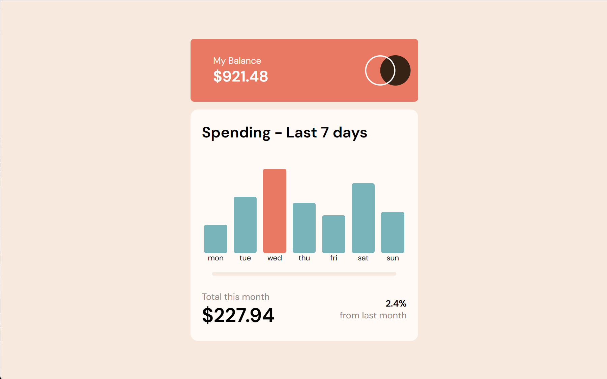
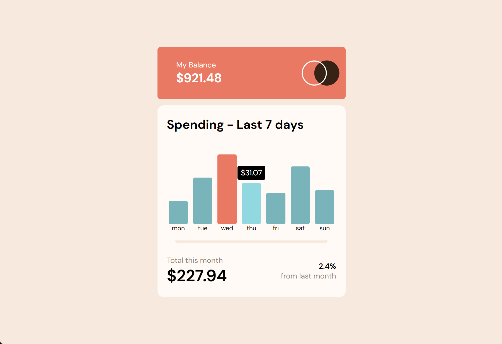
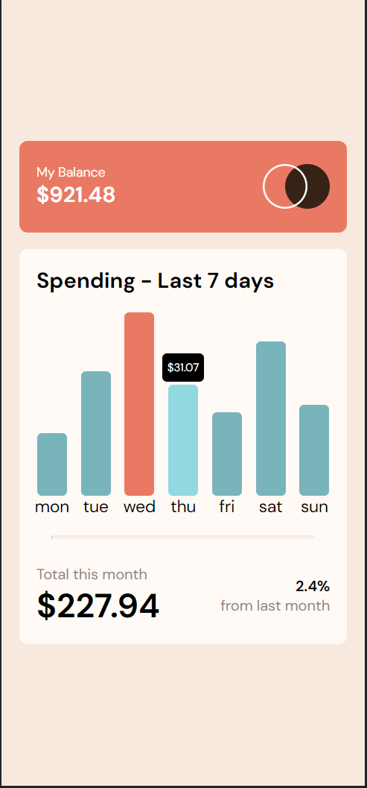

# Frontend Mentor - QR code component solution

This is a solution to the [Expenses chart component challenge on Frontend Mentor](https://www.frontendmentor.io/challenges/expenses-chart-component-e7yJBUdjwt/hub/expenses-chart-component-XCDivY5Qfz). Frontend Mentor challenges help you improve your coding skills by building realistic projects. 

## Table of contents

- [Overview](#overview)
  - [Screenshot](#screenshot)
  - [Links](#links)
- [My process](#my-process)
  - [Built with](#built-with)
  - [What I learned](#what-i-learned)
  - [Continued development](#continued-development)
- [Author](#author)
- [Acknowledgments](#acknowledgments)

## Overview

### Screenshot
- Desktop view

- Mobile View

### Links

- Solution URL: https://github.com/mrxshinji/expenses-chart
- Live Site URL: https://mrxshinji.github.io/expenses-chart

## My process

### Built with

- Semantic HTML5 markup
- Flexbox
- Mobile-first workflow
- React

### What I learned

- First time building bar chart using datas.map function

### Continued development

- Handling size of various item for responsiveness still quite annoying.

### Useful resources

- [https://stackoverflow.com/] - Provide alot of insight on centering item.
- [https://www.w3schools.com/] - Provide alot help on syntax and how to use each method

## Author

- Website - [https://github.com/mrxshinji]
- Frontend Mentor - [@mrxshinji](https://www.frontendmentor.io/profile/mrxshinji)

## Acknowledgments

- none
